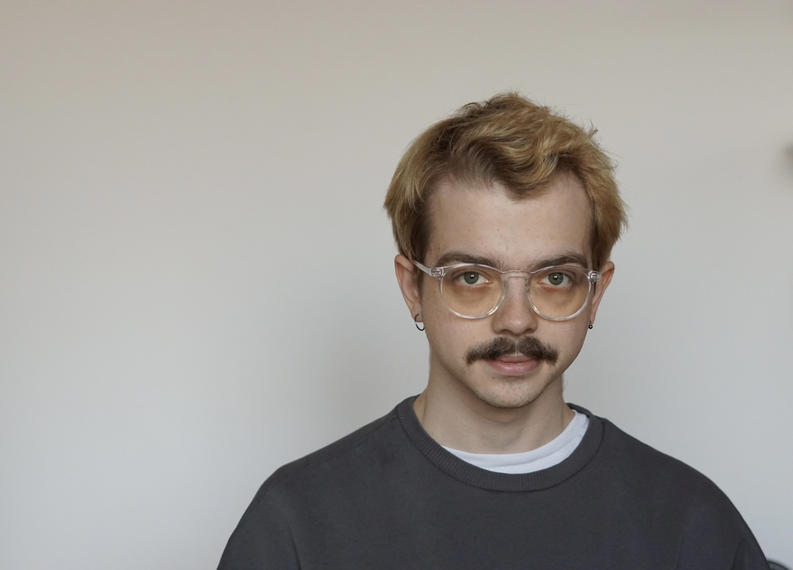

# /home/miro/about

## Who am I?

My name is Miro Kurka, I am graduate student of computer science at Pavol Jozef Safarik University in Kosice, Slovakia. I also worked as a DevOps engineer for the past 3 years. 

### Education
- undergraduate degree in biophysics @ UPJS
### Interests

- Ansible 
- Linux security
- Bioinformatics and HPC

### Certificates 
- AWS Certified Solutions practitioner

- Hashicopr Certified Terraform Associate
  
- now working towards RHCSA

